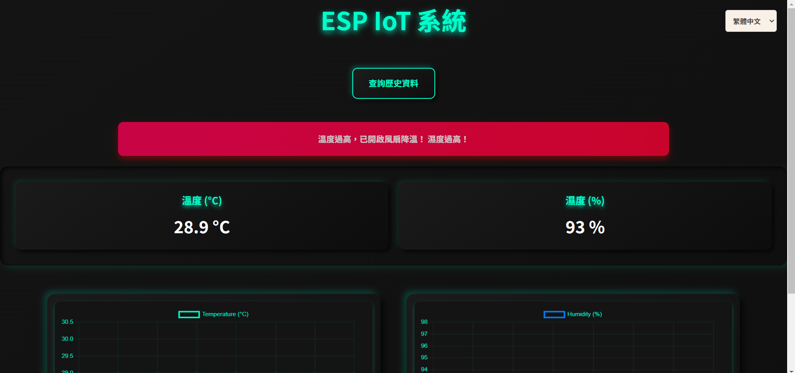
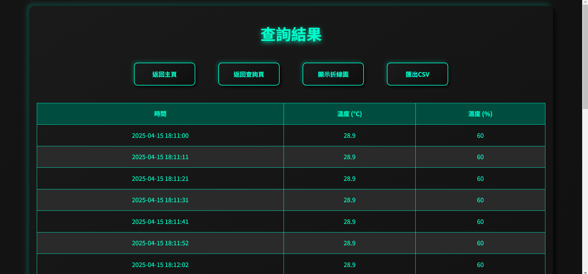
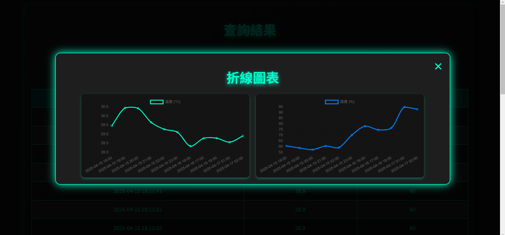

# 🌿 AIoT 植物生態箱智慧監控系統

本專案為一套基於 D1 Mini 微控制器與多種感測元件打造的 AIoT 智慧植物生態箱，具備即時監控、異常警報、數據視覺化與歷史資料匯出功能，支援多語言切換，提升居家與農業環境的植物養護效率與便利性。

## 🔧 系統功能特色

- 🌡️ 溫濕度即時監控（DHT11 感測器）
- 💡 LED 環形燈控制與 OLED 顯示
- 🌬 自動風扇控制（高溫時啟動）
- 🌐 網頁前端顯示＋資料庫連接（PHP + MySQL）
- 📈 折線圖即時更新，顯示最新感測資料
- ⚠️ 數值異常即觸發警報（文字變色、閃爍）
- 📤 支援 CSV/PDF 數據匯出
- 🌍 多語系切換（繁中、英文、日文、韓文、法文、俄文）

## 🖥 技術架構

- 硬體：D1 Mini、DHT11、OLED、WS2812B LED 燈、4x4 薄膜鍵盤、DC 風扇
- 軟體：
  - 前端：HTML / CSS / JavaScript / Chart.js
  - 後端：PHP + MySQL（XAMPP）
  - MCU 開發：Arduino IDE

## 🧠 系統擴展潛力

- 整合更多感測器（如土壤濕度）
- 引入 AI 進行數據分析與異常預測
- 支援 LoRa/NB-IoT/5G 等遠端通訊方式
- 加強資料安全性（如 TLS、驗證）

## 🧪 成果與展示

- 即時溫濕度圖表＋OLED 顯示畫面
- 異常紅色閃爍提示機制
- Discord 警示同步推播
- 可匯出完整日報數據（PDF/CSV）

  
 
 
 

## 📚 參考資料

- 《Arduino 微電腦應用實習》
- 《挑戰PHP7 MySQL 程式設計與專題特訓班》
- 《UML物件導向系統分析與設計》第四版

---

> 本專案展示了智慧環境監測在農業與居家應用的潛力，透過感測器、自動控制與即時視覺化介面，有效提升植物存活率並簡化養護管理流程。
